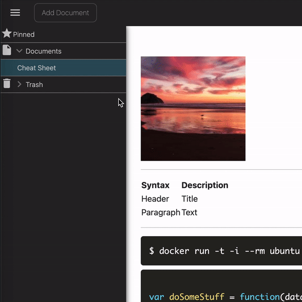
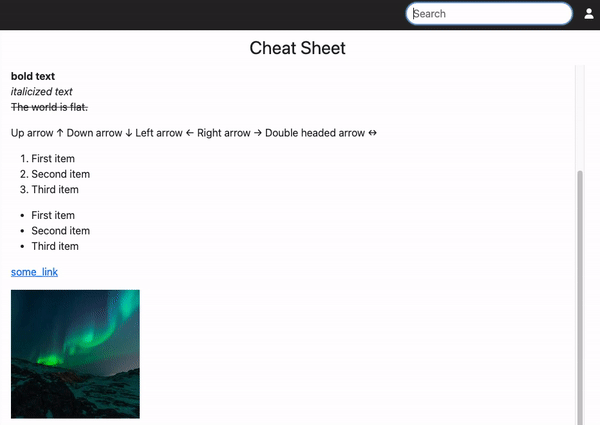

  
  <h1>Rocketnotes</h1>
  
  
  

## What is Rocketnotes?
Rocketnotes is a Markdown Editor for the Web.
Save, structure and share if you like daily notes and learnings in the browser from any device. 
You can [sign up](https://takeniftynotes.auth.eu-central-1.amazoncognito.com/login?response_type=code&client_id=tt3v27pnqqh7elqdvq9tgmr9v&redirect_uri=https://app.takeniftynotes.net) for free (Yes, it's free and it will be free forever as far as possible), run it on your local machine with Docker or deploy it with low effort in your personal AWS account and your desired region.
Check out the [installation guides](INSTALLATION.md#installation) for deploying Rocketnotes at [AWS](INSTALLATION.md#aws-hosting) or running it on your [local machine with Docker](INSTALLATION.md#run-on-your-local-machine-with-docker).

> **_NOTE:_**  Hosting on AWS with a Cloudfront distribution for S3, DynamoDB and Lambda will cost you less than $1 per month under normal usage.

## Want to contribute?
The most comfortable way to get started is to open the project in a ready-to-code Gitpod workspace with all packages & tools preinstalled and a running database with sample data.

If you prefer to setup the project on your local machine visit the [get started guide](CONTRIBUTING.md#getting-started) with all required steps to run the project locally in development mode.

You find also the contribution guidelines there.
Don't hesitate to open an issue for getting some feedback about a potential bug or if you desire a missing feature.
We also appreciate to check over current [issues](https://github.com/fynnfluegge/rocketnotes/issues) and provide feedback to existing ones or even raise a PR which solves an issue.
Any contribution is welcome!

## Features

### Create code snipptes with syntax highlighting 
- 📝 Use the power and simplicity of Markdown for your personal notes.
- 👀 Markdown is a straightforward WYSIWYG description language. 
- 💻 Create useful code snippets in your favourite programming language with syntax highlighting.
- 📖 Share documents with external users.

  

&nbsp;

### Hierarchical Document Tree
- 📚 Save your note documents hierarchical with unlimited depth of subdocuments.
- 🗂️ Structure your notes by simply drag and drop the desired document.
- 🌟 Pin favourite documents for fast top-level access.

  

&nbsp;

### Superfast Document Search
- 🔎 Search all your documents by content
- 🚀 Get an autosuggestion panel with all documents matching you search pattern - superfast!

  

&nbsp;

## 📝 License

Copyright © 2023-present, [Rocketnotes Contributors](https://github.com/fynnfluegge/rocketnotes/graphs/contributors). 
This project is [MIT](https://github.com/fynnfluegge/rocketnotes/blob/main/LICENSE) licensed.
